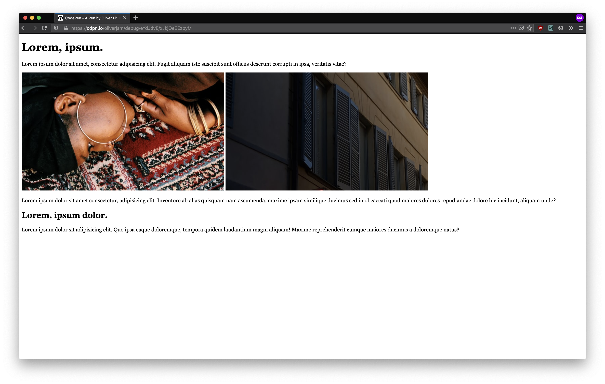
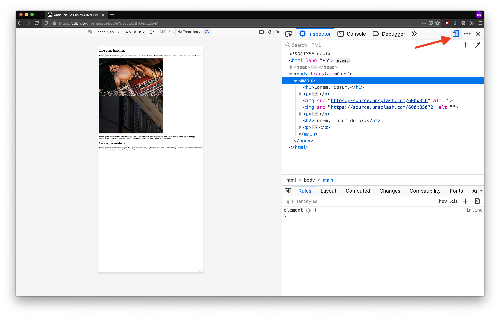
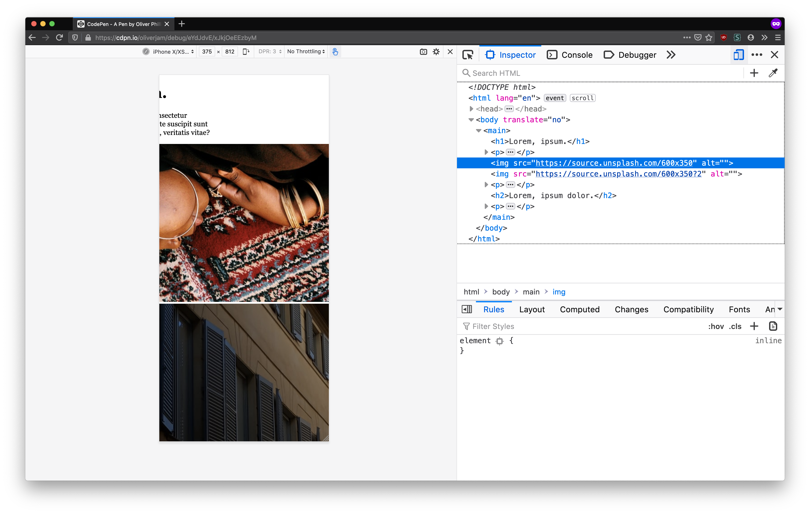
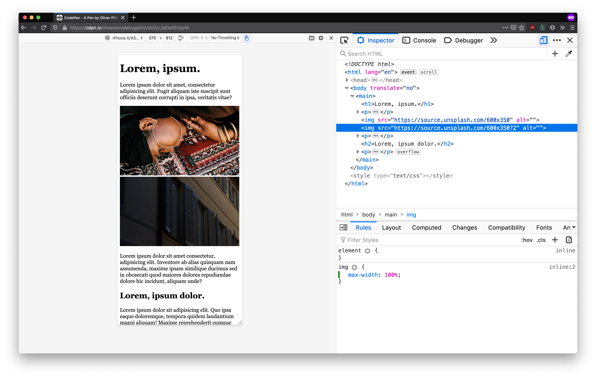
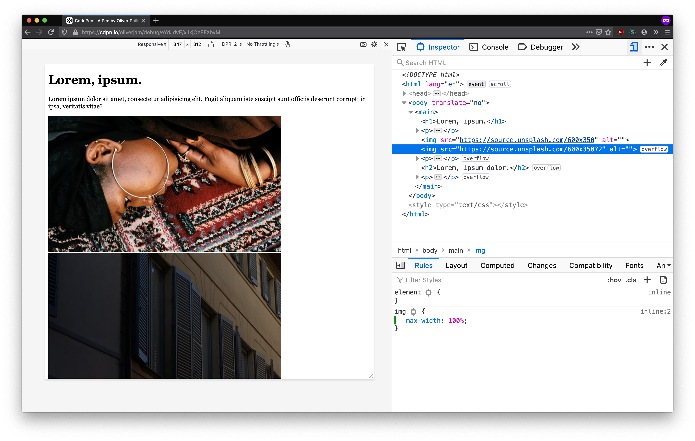
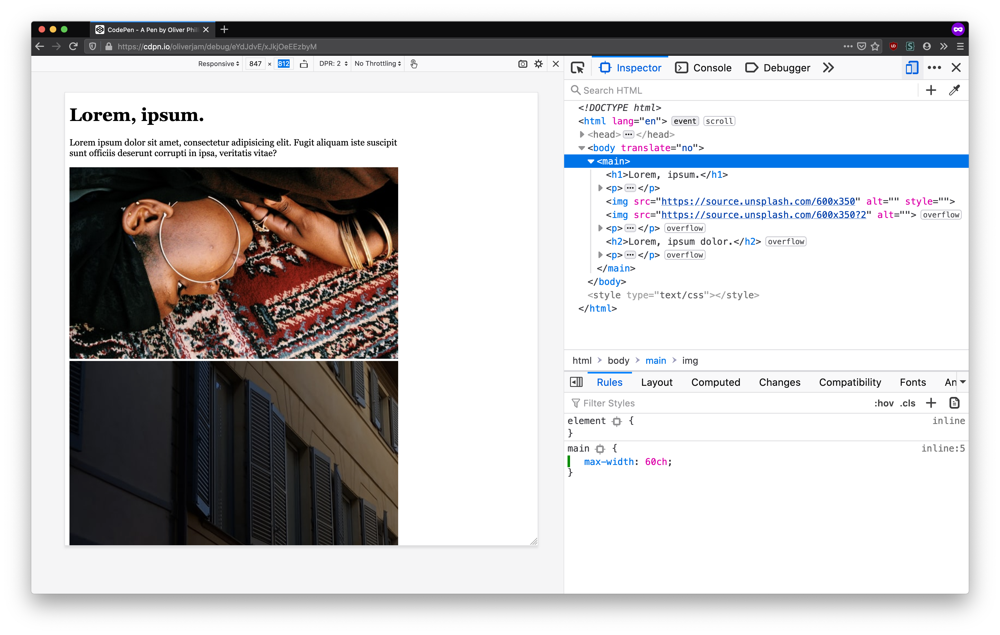
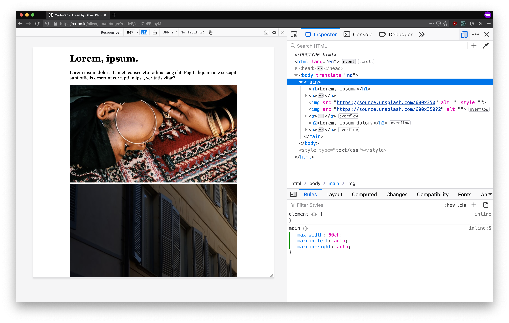
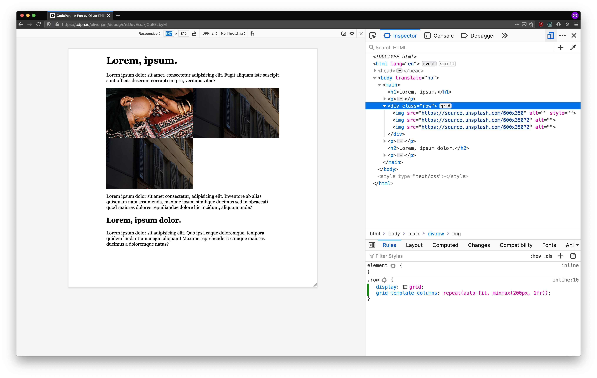
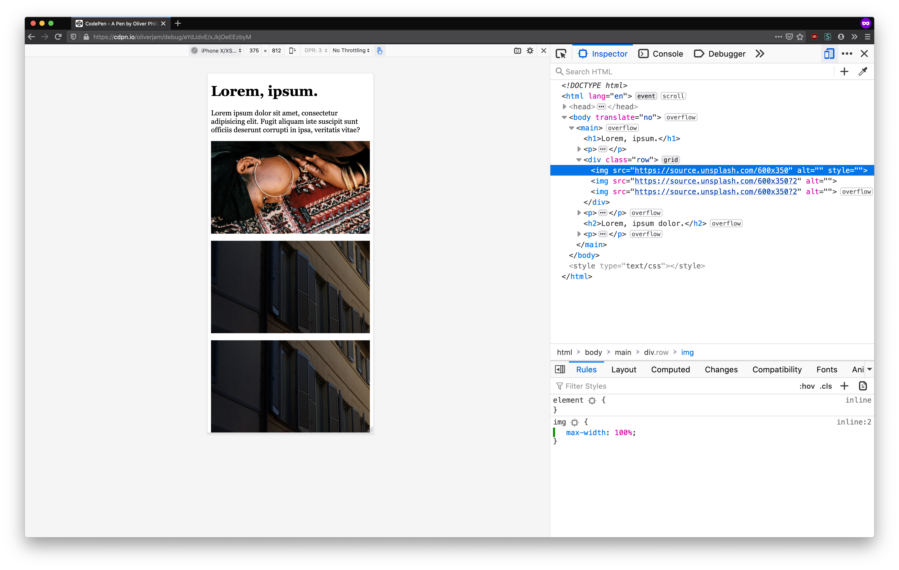

Responsive Design can be a scary thing to a beginner. It's got a special name, which makes people think they need to do special things to achieve it. I'm going to explain a bit about how responsive design developed, then demonstrate making a simple web page work on any screen size with very little CSS.

## Responsive Design history

In the early days of the web layouts were mostly single columns. CSS didn't have any way to control where things went on the page. Eventually people began abusing the `<table>` element to achieve complex layouts. This let them control exactly where things went on the page.

However tables had a big downside: they required hard-coding everything with absolute pixel values. This meant sites tended to be laid out to a fixed width design. Fixed width pages were okay when everybody browsed the web on pretty much the same size screen (768px wide) desktop monitors. However this became a big problem when people started browsing the web on their phones.

Early smartphone screens were _tiny_ in comparison (the original iPhone screen was 320px wide). To cope with this developers began creating "mobile sites". These were entirely separate pages served from a separate URL (e.g. m.facebook.com). Creating a totally separate site/layout for mobile was a lot of overhead, especially for small teams.

In 2010 (three years after the original iPhone was released) [Ethan Marcotte](https://ethanmarcotte.com/) wrote [an article titled "Responsive Web Design"](https://alistapart.com/article/responsive-web-design/). It explained a new technique for building web pages with _flexible_ layouts by using "media queries" to apply certain styles at different screen widths.

## Modern responsive design

Back then CSS had almost no features dedicated to layout. Luckily now we have access to flexbox, CSS grid and other things designed for creating flexible layouts that work across any screen size.

People often think of "responsive design" as a special extra task they have to do after creating a web page. I would suggest designing with a flexible, responsive mindset from the very beginning. This way you often don't have to do anything "extra".

## Start with HTML

HTML is responsive by default. It's designed to never hide, cut-off or otherwise obscure content. If you never added any CSS your content would always be "responsive" (although it wouldn't look so pretty).

So we'll start by writing our HTML and making sure we have all the correct semantic elements in place. This will give us a base to enhance with CSS.

### Document structure

First we need to define the structure of our HTML document. If you want to learn more about what each of these tags does you can read my ["complete guide to making web-pages"](complete-guide-to-making-web-pages) post.

```html
<!DOCTYPE html>
<html lang="en">
  <head>
    <meta charset="utf-8" />
    <title>My web page</title>
  </head>
  <body>
    <!-- content goes here -->
  </body>
</html>
```

Then we can add some content inside the `<body>`. Let's add some headings, paragraphs and a couple of images.

```html
<body>
  <main>
    <h1>Lorem, ipsum.</h1>
    <p>
      Lorem ipsum dolor sit amet, consectetur adipisicing elit. Fugit aliquam
      iste suscipit sunt officiis deserunt corrupti in ipsa, veritatis vitae?
    </p>
    
    
    <p>
      Lorem ipsum dolor sit amet consectetur, adipisicing elit. Inventore ab
      alias quisquam nam assumenda, maxime ipsam similique ducimus sed in
      obcaecati quod maiores dolores repudiandae dolore hic incidunt, aliquam
      unde?
    </p>
    <h2>Lorem, ipsum dolor.</h2>
    <p>
      Lorem ipsum dolor sit adipisicing elit. Quo ipsa eaque doloremque, tempora
      quidem laudantium magni aliquam! Maxime reprehenderit cumque maiores
      ducimus a doloremque natus?
    </p>
  </main>
</body>
```

If we open this in a browser we should see the content.



We can use our browser's developer tools to simulate a mobile device, to see how this would look on a smaller screen. In Firefox this button is at the top right of devtools (in Chrome it's at the top left).



This shows us that our content still fits on a small screen (we've selected the iPhone XS size here).

### Viewport meta tag

There's a problem: everything is very zoomed out. This is because when mobile browsers were first created most sites were not optimised for the smaller screen. So browsers had to compensate by zooming out to fit everything on screen.

You can opt-out of this behaviour by adding a meta tag to the `<head>` of your document:

```html
<meta name="viewport" content="width=device-width, initial-scale=1" />
```

This tells the browser that your site should scale down to smaller screens, so don't zoom out.

Our site now looks the same on the narrower screen:


## Sprinkle on CSS

Now that we have our document structure in place we can start adding CSS. Let's add a style tag to the head of our document:

```html
<head>
  <meta charset="utf-8" />
  <title>My web page</title>
  <meta name="viewport" content="width=device-width, initial-scale=1" />
  <style>
    /* css goes in here */
  </style>
</head>
```

### Image sizing

Our images are overflowing horizontally. They are too wide for the viewport and so make the page wider, which means users have to scroll sideways to see the rest of the image.



This happens because images are displayed at their real size by default. In this case the images are 600px wide, but the iPhone viewport is only 375px wide.

Ideally we want the images to scale down to fill whatever container they are inside. They should never overflow like this. We can use CSS to tell all images that they should never be wider than their container:

```css
img {
  max-width: 100%;
}
```

This is all we need to get the images to fit the mobile viewport:



### Mobile-first

We now have our mobile layout looking pretty good, with almost no CSS required. Obviously it's not pretty yet, but all the content is present and fits on the screen.

"Mobile-first" design means ensuring your page looks correct on a smaller screen before moving on to larger ones. Mobile layouts are usually the simplest, since they're mostly just one column of content.

We should make our screen a little bigger and write some more CSS to handle cases where the page doesn't look right.

### Line length



At a medium viewport size we can see that the content is getting a bit wide. It's hard for users to read long lines of text, since their eyes have to move so far from left to right. Generally it's best to keep line length [between 45 and 75 characters](https://www.smashingmagazine.com/2014/09/balancing-line-length-font-size-responsive-web-design/).

We can achieve this with a `max-width` on the `main` element to ensure it never gets wider than a certain size.

Since we care about how many characters fit on a line we can use the [`ch` unit](https://developer.mozilla.org/en-US/docs/Learn/CSS/Building_blocks/Values_and_units#Relative_length_units). This unit refers to the width of the `0` character in the current font.

```css
main {
  max-width: 60ch;
}
```

This rule tells the browser to prevent the `<main>` from growing larger than 60 characters wide.

We can see that the content now doesn't get too long to read on wider viewports:



Since we set a _max_ width this won't affect anything on smaller viewports. The content will fill the width of the screen until it hits 60 characters wide, then it will stop growing.

### Centre layout

Our page content is stuck over on the left side of the viewport. This isn't _bad_, but it's common for websites to put their main content in the centre of the page.

We can use `margin` to achieve this. An `auto` value for margin tells the browser to make that margin as big as possible to fill the space.

For example `margin-left: auto` on this box pushes it all the way to the right side (the left margin takes up all available space):

<div style="background: var(--bg); border: 2px solid var(--primaryShadow)">
  <div style="width: 150px; height: 150px; background: var(--primary); margin-left: auto"></div>
</div>

Setting both left _and_ right margin to `auto` creates an equal amount of space on either side, pushing the element into the middle:

<div style="background: var(--bg); border: 2px solid var(--primaryShadow)">
  <div style="width: 150px; height: 150px; background: var(--primary); margin-left: auto; margin-right: auto"></div>
</div>

We can use this technique to force our `main` element to always be centred in the page:

```css
main {
  max-width: 60ch;
  margin-left: auto;
  margin-right: auto;
}
```



## Image layout

Our images are kind of huge on wider viewports. Since they fill the entire 60-character-wide container they end up really tall, which pushes the rest of the content off the screen.

Since we have more space it would be nice to put the images next to each other in a row. We _could_ use a media query for this, which would let us specify some CSS rules that only applied above a certain viewport width.

```css
@media (min-width: 40em) {
  img {
    max-width: 50%;
  }
}
```

This says "when the viewport is above 40em wide (i.e. bigger than a phone) make the images half the width of their container". This works okay, but it requires us to hard-code the viewport size where the images switch.

It would be nicer if we could tell the browser that we want to fit images all in a row, as long as they don't shrink below some minimum size. We can achieve this using CSS grid. First we need to wrap the images in a container element:

```html
<div class="grid">
  
  
</div>
```

We set the container's display property to `grid`. This tells it to lay all its children out within a grid that we can specify.

```css
.grid {
  display: grid;
}
```

Then we tell the grid container how many columns it should have. We could hard-code these, e.g.

```css
.grid {
  display: grid;
  grid-template-columns: 1fr 1fr;
}
```

<div style="background: var(--bg); border: 2px solid var(--primaryShadow); display: grid; grid-template-columns: 1fr 1fr; gap: 0.5rem; padding: 0.5rem; color: var(--text-code)">
  <div style="width: 100%; height: 150px; background: var(--primary); margin-left: auto; display: grid; place-content: center">1fr</div>
  <div style="width: 100%; height: 150px; background: var(--primary); margin-left: auto; display: grid; place-content: center">1fr</div>
</div>

This creates two equal size columns, since the `fr` unit means "fraction of the available space". However this only works if there are two images. It also won't work on mobile since the two columns will be too small when the viewport is narrow.

<div style="max-width: 200px; background: var(--bg); border: 2px solid var(--primaryShadow); display: grid; grid-template-columns: 1fr 1fr; gap: 0.5rem; padding: 0.5rem; color: var(--text-code)">
  <div style="width: 100%; height: 150px; background: var(--primary); margin-left: auto; display: grid; place-content: center">1fr</div>
  <div style="width: 100%; height: 150px; background: var(--primary); margin-left: auto; display: grid; place-content: center">1fr</div>
</div>

Ideally our layout should be flexible so we can change the content without it breaking. The `repeat` function lets us create multiple columns of the same size, e.g.

```css
.grid {
  display: grid;
  grid-template-columns: repeat(2, 1fr);
}
```

This reduces the duplication in our code but we still have to hard-code the number of columns. Luckily repeat can take the `auto-fit` keyword instead of a number. This tells the grid to create as many columns of a given size as it can fit. E.g.

```css
.grid {
  grid-template-columns: repeat(auto-fit, 200px);
}
```

However now we must hard-code the _size_ of the columns (since `repeat` needs an absolute value so it knows how many columns it can fit). If we want to automatically add new columns with _flexible_ sizes we must use the `minmax` function. This takes a minimum and maximum size, and picks a value in between.

```css
.grid {
  grid-template-columns: repeat(auto-fit, minmax(200px, 1fr));
}
```

This tells the grid container to create as many columns as it can with a minimum size of 200px. If there are too many children to fit then it will create extra rows for them underneath.



The final step is to add some space between the images. We can create gaps between grid rows/columns:

```css
.grid {
  grid-column-gap: 1rem;
  grid-row-gap: 1rem;
}
```

If the space between columns and rows is the same this can be simplified:

```css
.grid {
  gap: 1rem;
}
```




We've achieved a grid layout without even using any media queries. This means it's more flexible and will change fluidly as the viewport size changes. It's always a good idea to constrain your layout based on the size of the _content_, rather than the size of the viewport.

## In summary

We've taken our strong HTML base and built a robust layout that adapts to any screen size with only a few CSS rules. Working "mobile-first", starting with the narrowest size and adding rules as needed when the viewport grows, lets us write relatively simple code to create solid layouts.

Here's the final CSS all together:

```css
img {
  max-width: 100%;
}

main {
  max-width: 60ch;
  margin-left: auto;
  margin-right: auto;
}

.grid {
  grid-column-gap: 1rem;
  grid-row-gap: 1rem;
}
```

This is obviously not _all_ the CSS you'd want on your own page, as you'll have specific elements that need styling differently. This is not meant to be a series of "CSS tricks" you can copy to your own project but instead a _mindset_ you can apply when writing your own layouts.
